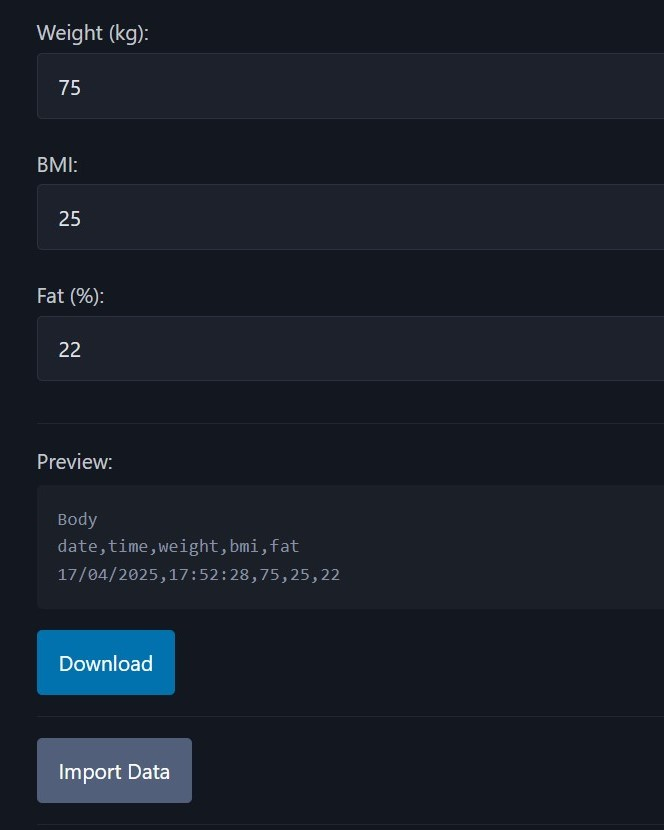

# Garmin Connect Custom Import

[](https://github.com/jamesmoriarty/garmin-connect-custom-import-data/actions/workflows/ci.yaml) [](https://github.com/jamesmoriarty/garmin-connect-custom-import-data/actions/workflows/static.yml)

[BMI as a measure is inaccurate and misleading](https://www.medicalnewstoday.com/articles/265215). [Index™ S2 Smart Scale](https://www.garmin.com/en-NZ/p/679362) has also been reported with [limited accuracy](https://www.youtube.com/watch?v=lBgNZLh5vmg), so I've built this to manually import data into Garmin Connect. The tool can be found [here](https://www.jamesmoriarty.xyz/garmin-connect-custom-import-data/).

## Screenshots



## Default Calculations

### BMI

```
weight / ((height / 100) ^ 2)
```

### Fat Percentage

```
(1.20 * bmi) + (0.23 * age) - 16.2
```

## Alternative Methods

### [Bioelectrical Impedance Analysis](https://www.sciencedirect.com/science/article/pii/S2405457721002989)

```
±4-8%
```

### [Navy Measure](https://pubmed.ncbi.nlm.nih.gov/8437737/)

```
±3.5%
```

### [Vibes Based](https://www.youtube.com/watch?v=dQw4w9WgXcQ)

```
±200%
```

## Development

```
npm run start
```

## Test

```
npm run test
```

## Build

```
npm run build
```

