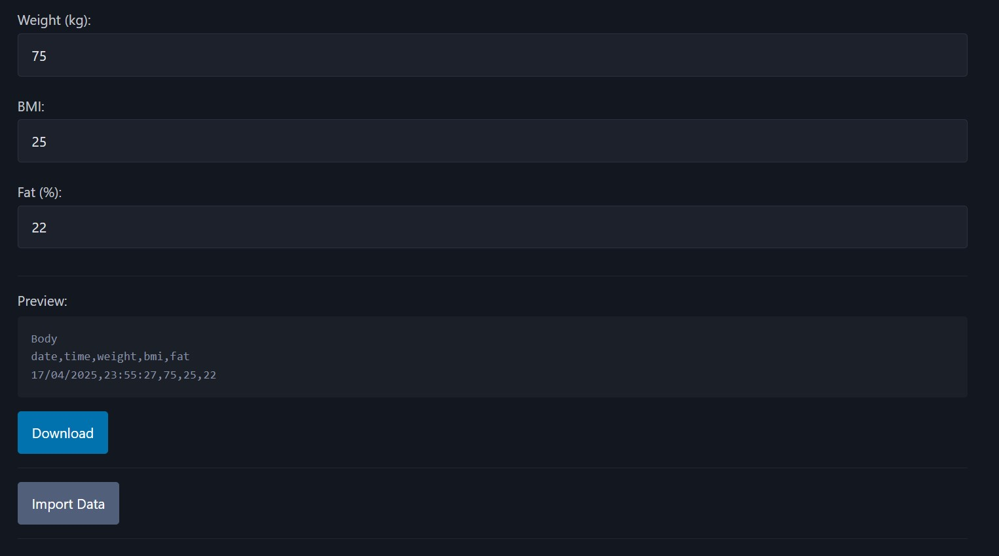

# Garmin Connect Custom Import

[](https://github.com/jamesmoriarty/garmin-connect-custom-import-data/actions/workflows/ci.yaml) [](https://github.com/jamesmoriarty/garmin-connect-custom-import-data/actions/workflows/static.yml)

[BMI as a measure is inaccurate and misleading](https://www.medicalnewstoday.com/articles/265215). [Index™ S2 Smart Scale](https://www.garmin.com/en-NZ/p/679362) have also been [reported to be inaccurate](https://www.youtube.com/watch?v=lBgNZLh5vmg) so I've built this tool to manually import more accurate data into Garmin Connect.

The tool can be found [here](https://www.jamesmoriarty.xyz/garmin-connect-custom-import-data/).

## Screenshots



## Default Calculations

### BMI

```
weight / ((height / 100) ^ 2)
```

### Fat Percentage

```
(1.20 * bmi) + (0.23 * age) - 16.
```

## Development

```
npm run start
```

## Test

```
npm run test
```

## Build

```
npm run build
```

